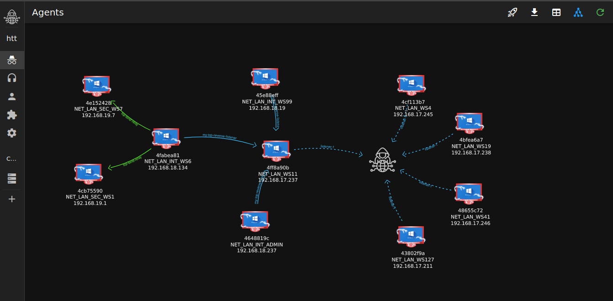
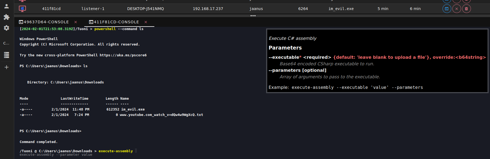

<!-- markdownlint-configure-file {
  "MD013": {
    "code_blocks": false,
    "tables": false
  },
  "MD033": false,
  "MD041": false
} -->
<br /><br />
<div align="center">

  <br />
<h1>Tuoni</h1>

[](https://discord.gg/fd8caSs8Vj)


  
<i align="center">
Tuoni is a sophisticated, cross-platform red teaming framework designed to enhance cybersecurity education and training through large-scale cyber defense exercises. Developed using Java for robustness, Docker for versatility, and featuring an intuitive web browser interface, it supports and streamlines cyber exercises. With its modular, extendable plugin system, Tuoni offers Red Teamers the flexibility to tailor its capabilities for specific educational and exercise needs. Its user-friendly interface facilitates easy operation and efficient reporting, essential in training environments. Tuoni embodies a commitment to power, adaptability, and collaboration, aimed at empowering Red Teamers with a tool that meets the dynamic demands of modern cyber defense education.
  </i>
  </div>
<br/><br/>





## Installation

Installer will try to install docker version 25.0.0 or greater

```bash
wget  -O - https://tuoni.sh | bash
cd tuoni
```
or if you prefer curl
```
curl https://tuoni.sh | bash
cd tuoni
```

---

If you prefer to install without any user input, add SILENT=1 to the command line
```
export SILENT=1; curl https://tuoni.sh | bash
```
additional variables available and their defaults:
- TUONI_USERNAME=tuoni
- TUONI_PASSWORD=autogenerated
- TUONI_DOCKER_IPV6_ENABLED=false

If you run the install again, it will try to update tuoni. SILENT=1 will skip prompts, as mentioned before.

For automation purposes, NO_UPDATE=1 will skip updating the app.

---

in the unlikely event of nothing happening, try installing wget or curl first...
```bash
sudo apt-get install -y wget curl
```

- it is safe to run the setup multiple time
- if tuoni is already installed, the oneliner will run `tuoni update` command instead - the Tuoni C2 will be restarted

## Documentation
https://docs.shelldot.com/
